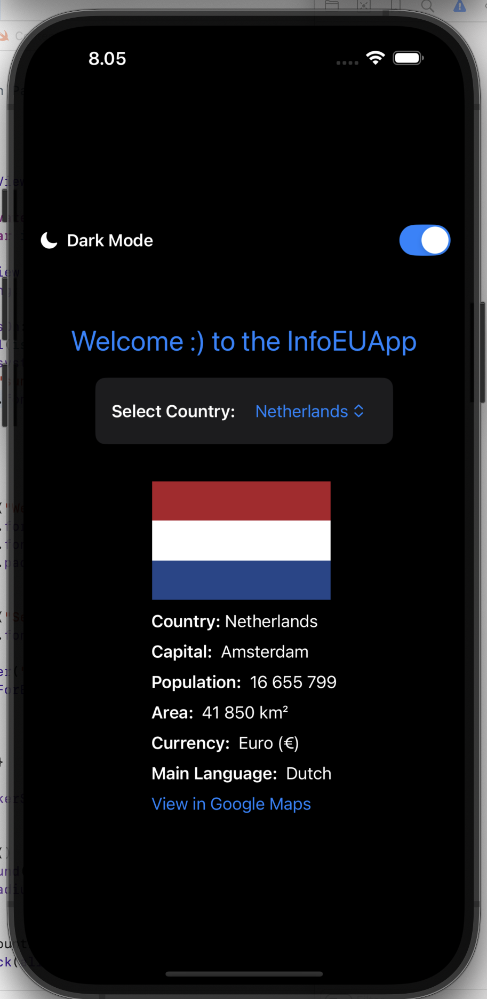
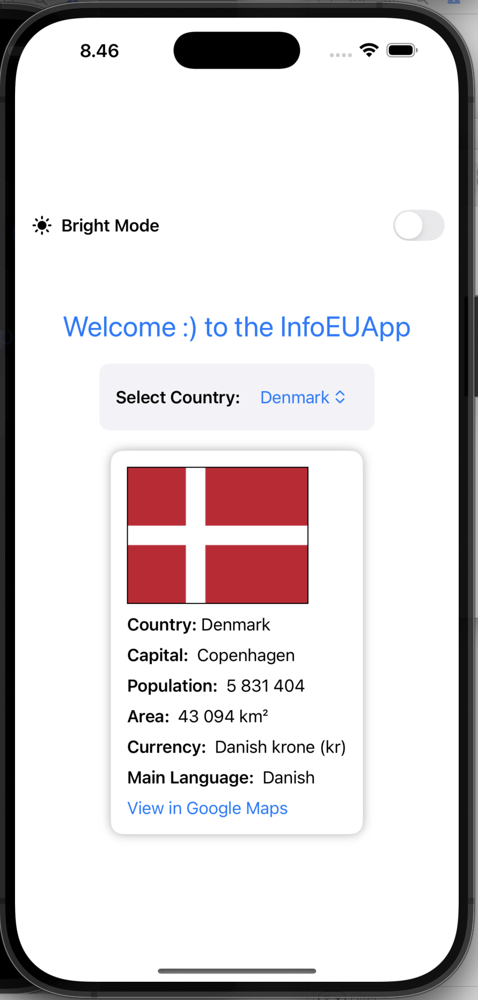

# 🌍 EUCountriesApp

EUCountriesApp is a SwiftUI-based iOS app that provides an interactive way to learn about European Union countries. It fetches real-time country data (like population, area, and flags) and presents it in a simple, user-friendly interface. Users can select any EU country from a dropdown and explore key information instantly.

---

## ✨ Features

- ✅ View detailed information about EU countries
- ✅ Display official country names, flags, capitals, and population
- ✅ Embedded Google Maps link to the country's location
- ✅ Dark Mode support
- ✅ Organized MVVM architecture

---

## 🎮 Planned Features (Coming Soon)

- 🇪🇺 **Flag Quiz Game**  
  A fun game where users guess the country by its flag

- 🧠 **Trivia Mode**  
  Quizzes like “Which country has the largest population?”, “Which country joined the EU in 1995?”, etc.

- 🗺️ **Interactive Map View**  
  Tap a country to view it on a mini map inside the app

- 🔍 **Search & Filter**  
  Quickly find countries by name, region, or currency

- 🎨 **More Themes**  
  Custom color schemes to personalize the app

---

## 🖼️ Screenshots

> _Screenshots from emulator_

<p align="center">

  
</p>


## 🖼️ 📹 App Video preview
▶️ [Click to watch the demo video](https://github.com/user-attachments/assets/36270767-4baa-48bb-a0e4-efd05bb26db0)

## 🛠️ Project Structure
```bash

EUCountriesApp/
│
├────── Models/
│  │
│  └── Country.swift
├────── ViewModels/
│ │
│ └── CountryViewModel.swift
│
├───── Views/
│ │
│ └── ContentView.swift
│
├── EUCountriesApp.swift
```


-------

## 📦 Dependencies

- Swift 5.9+
- Xcode 15+
- SwiftUI

---

## 🚀 Getting Started

1. Clone the repo  
   `git clone https://github.com/009Rambo/EUCountriesApp.git`

2. Open in Xcode  
   `open EUCountriesApp.xcodeproj`

3. Run on Simulator or your device

---

## 💡 Contributions

Suggestions, feature requests, and pull requests are welcome!

---

## 📧 Contact

Feel free to reach out via GitHub issues or open a discussion.

---

> Made with 💛 using SwiftUI
